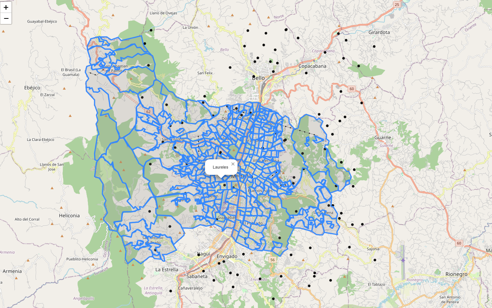

# Geolocalización

Repositorio donde iré subiendo funciones que pueda necesitar en un futuro relacionadas con geolocalización.

Datos obtenidos de: https://www.medellin.gov.co/geomedellin/datosAbiertos/1044

- geomedellin: Permite representar los barrios (poligonos) en un mapa y asignar esos barrios a coordenadas generadas aleatorimente.

